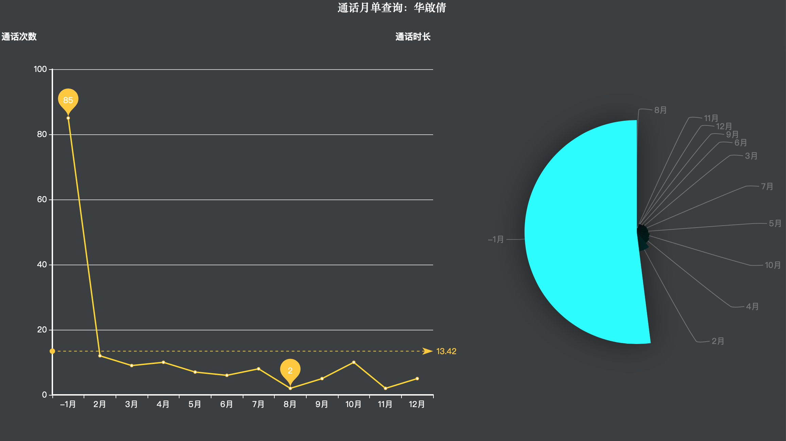

# 一、项目简介
大数据时代的到来，对数据的处理和分析有了很高的要求。本项目以通化数据去展示如何处理并分析大数据，并最终通过图表可视化展示。

> 本项目主要分为以下几个部分

1. 生产日志【模拟通话】
2. 数据采集/消费
3. 数据分析
4. 数据展示

# 二、项目实现

本项目由多个模块构成，这些模块之间可以独立运行。所有模块如下

1. CTCC_producer 实现数据生产 
2. CTCC_consumer 实现数据采集（Flume）和消费 (Kafka),写入到HBase 
3. CTCC_analysis 实现数据分析 
4. CTCC_web 实现数据的可视化 

# 三、各模块测试流程

## 3.1、CTCC_producer

### 3.1.1、将源码打包为call_log.jar,并上传到服务器

```
$ cp call_log.jar ~/training_jobs/ctcc
```
### 3.1.2、添加生成日志的脚本

```
$ vi ~/training_data/ctcc/call_log.sh

#!/bin/bash
java -cp ~/training_jobs/ctcc/call_log.jar com.nil.ProductDriver ~/training_data/ctcc/call_log.csv
```
### 3.1.3、给脚本添加执行权限

```
$ chmod +x ~/training_data/ctcc/call_log.sh
```
### 3.1.4、开始数据生产

```
$ bash ~/training_data/ctcc/call_log.sh
```

## 3.2、CTCC_consumer

### 3.2.1、创建并查看主题
```
$ kafka-topics.sh --zookeeper localhost:2181 --delete --topic calllog 
$ kafka-topics.sh --zookeeper localhost:2181 --topic calllog --create --replication-factor 1 --partitions 3
$ kafka-topics.sh --zookeeper localhost:2181 --list
```
### 3.2.2、启动kafka消费者,等待flume输入

> 低版本

```
$ kafka-console-consumer.sh --zookeeper localhost:2181 --topic calllog --from-beginning
```
> 高版本

```
$ kafka-console-consumer.sh --bootstrap-server localhost:2181 --topic calllog --from-beginning
```

### 3.2.3、创建flume配置文件并启动相关任务

```
$ vi $FLUME_HOME/jobs/flume-task-ctcc.conf 

# define
a1.sources = r1
a1.sinks = k1
a1.channels = c1

# source +0 是从第0行开始
a1.sources.r1.type = exec
a1.sources.r1.command = tail -F -c +0 /Users/lianyou/training_data/ctcc/call_log.csv
a1.sources.r1.shell = /bin/bash -c

# sink
a1.sinks.k1.type = org.apache.flume.sink.kafka.KafkaSink
a1.sinks.k1.brokerList = localhost:9092
a1.sinks.k1.topic =calllog
a1.sinks.k1.batchSize = 20
a1.sinks.k1.requiredAcks = 1

# channel
a1.channels.c1.type = memory
a1.channels.c1.capacity = 1000
a1.channels.c1.transactionCapacity = 100

# bind
a1.sources.r1.channels = c1
a1.sinks.k1.channel = c1
```

```
# flume-ng agent $FLUME_HOME/conf/ --name a1 --conf-file $FLUME_HOME/jobs/flume-task-ctcc.conf  & 
```

## 3.3、 CTCC_analysis 实现数据分析 

## 3.4、CTCC_web 实现数据的可视化 

